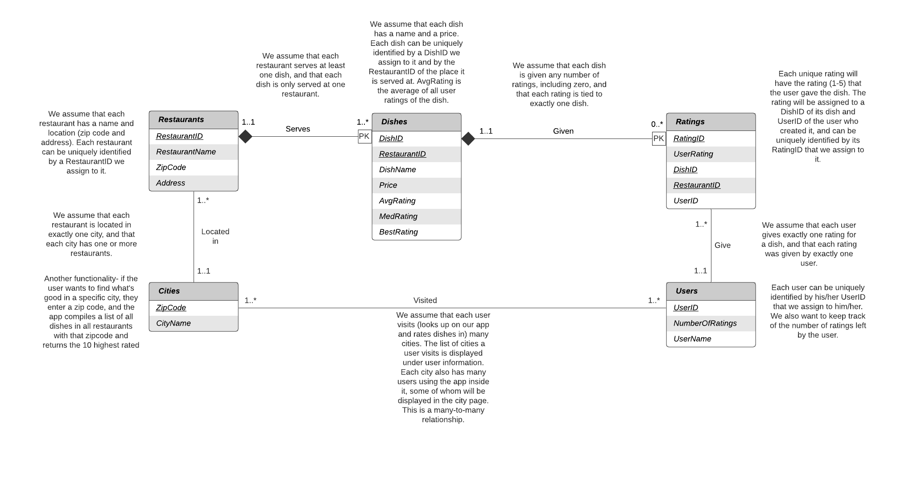

# What's Good Here
This is a web app that shows different restaurants and their dishes. Authorized users are allowed to rate these dishes and contribute to the database. 

## UML Diagram


## Requirements
```
python >= 3.5
```

## Running this Project Locally
```bash
git clone https://github.com/franklinmoy3/whats-good-here.git whatsgoodhere
cd whatsgoodhere
python -m venv .venv
source .venv/bin/activate
pip install -r requirements.txt
export FLASK_APP=app
# uncomment the below line to have Flask automatically refresh after modifying a Python file
# export FLASK_DEBUG=1
flask run
```

## GCP Deployment
Create a `app.yaml` file in the root folder with the following contents:
```yaml
runtime: python38 # or another supported version

instance_class: F1

env_variables:
  MYSQL_USER: <user_name> # username on the GCP MySQL instance
  MYSQL_PASSWORD: <user_pw> # password for the above GCP MySQL instance user
  MYSQL_DB: <database_name> # name of database on GCP MySQL instance
  MYSQL_HOST: <database_ip> # public IP of the GCP MySQL instance
  INSTANCE_CONNECTION_NAME: <instance_connection_name> # the instance's connection name

handlers:
# Matches requests to /images/... to files in static/images/...
- url: /img
  static_dir: static/img

- url: /script
  static_dir: static/script

- url: /styles
  static_dir: static/styles
```

Setting up the deployment
```bash
curl https://sdk.cloud.google.com | bash
gcloud components install app-engine-python
gcloud config set project [PROJECT_ID]
gcloud auth login
gcloud app deploy
```
